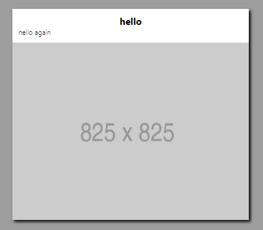
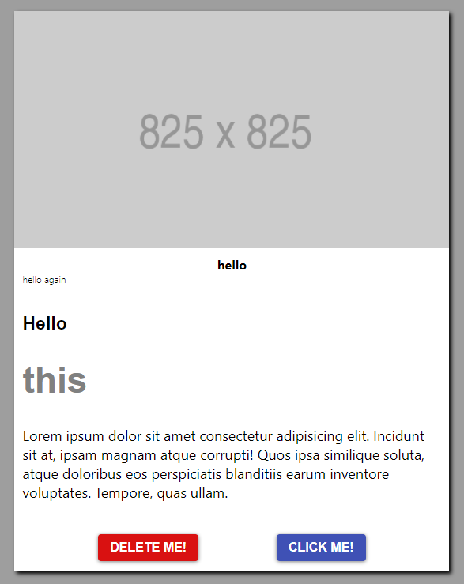

# Component library for react

- [Buttons](#Buttons)
- [Card](#Card)

# Buttons

```jsx
    <Button size="small" variant="primary">Small</Button>
    <Button size="medium" variant="primary">Medium</Button>
    <Button size="large" variant="primary">Large</Button>
```

Props

**'size'** has available options: 'sm' for small, 'md' for medium, 'rgl' for large.\
**'variant'** options: 'primary', 'secondary', 'warning', 'delete', 'send'.\
**'type'** optinos: 'outlined', 'contained'.

_If no props are passed, the default styling will be size 'md', variant 'primary', and type 'contained'._

## Props

|          |           |           |         |        |      |
| -------- | --------- | --------- | ------- | ------ | ---- |
| size:    | sm        | md        | rgl     |        |      |
| variant: | primary   | secondary | warning | delete | send |
| type     | outlined | contained  |         |        |      |

\
&nbsp;
\
&nbsp;

# Card

The card component is designed to take in other components like **Typography** and **Button**. As you import these components in to your card, the content within the card component will flex as needed to the height and width necessary.

```jsx
import CardText from 'bit-ui-wise'
import Typography from 'bit-ui-wise'

class CardText extends Component {
  render() {
    return (
      <CardText>
        <Typography varient='header' varient='sub-header'></Typography>
      </CardText>
    )
  }
}
```

```jsx
import CardButton from 'bit-ui-wise'
import Button from 'bit-ui-wise'

class CardButton extends Component {
  render() {
    return (
      [<Button variant="outlined" color="delete" size="sm">Click me</Button>, <Button size="sm" variant="outlined" color="warning">Click me</Button>]
    )
  }
}
```


\
&nbsp;

## Default Card

The default option for the card component is an empty container wit set styling, that allows the user to add content at their own discretion.



<hr />
When users add their own content, the card will resize to the proper dimensions within itself, giving the content room to grow or shrink.



---

\
&nbsp;

## Card

<hr />

Card component also returns props.children so all components within the Card component will take those style properties with it.

<hr />

### Props

| property              | props      | default | values        |          |                  |
| --------------------- | ---------- | ------- | ------------- | -------- | ---------------- |
| minWidth && maxWidth: | size:      | '100%'  | 'sm'          | 'md'     | 'lrg'            |
| height:               | height:    | null    | 'px'          | 'rem'    | '%'              |
| flexDirection:        | direction: | 'row'   | 'row-reverse' | 'column' | 'column-reverse' |
| backgroundColor:      | bgColor:   | 'white' | hex           | rgb      | 'color'          |

<hr />

```
  <Card size='sm' flexDirection='row' bgColor='#F9EAE1'>
    <Child Component>
  </Card>
```

<hr />

\
&nbsp;

## CardImage

<hr />

CardImage is a self closing component that takes in a image as a prop with a url, also props passed allowing for sizing and positioning.

<hr />

### Props

| property         | props    | default   | values  |       |         |
| ---------------- | -------- | --------- | ------- | ----- | ------- |
| backgroundColor: | bgColor: | 'white'   | hex     | rgb   | 'color' |
| backgroundImage: | img:     | null      | url     |       |         |
| backgroundSize:  | bgSize:  | 'contain' | 'cover' | '%'   | 'px'    |
| height:          | height:  | '300px'   | 'px'    | 'rem' | '%'     |
| width:           | imgSize: | '100%'    | 'sm'    | 'md'  | 'lrg'   |

<hr />

```
<CardImage img={'url'} bgSize='cover' height='150px' />
```

<hr />

\
&nbsp;

## CardText

<hr />

CardText takes {props.children} which will give a container for the typography component

<hr />

### Props

| property         | props      | default | values |     |         |
| ---------------- | --------   | ------- | ------ | --- | ------- |
| backgroundColor: | bgColor:   | 'white' | hex    | rgb | 'color' |
| textAlign:       | textAlign: | 'left'  | null   | rgb | null    |


<hr />

```jsx
<CardText alignText="center" bgColor='lightgrey'>
  <Typography> Hello World! </Typography>
<CardText />
```

\*Refer to Typography for specific Typography Props

<hr />

\
&nbsp;

## CardButton

<hr />

CardButton takes in an array of buttons using props and the .map() method.

<hr />

### Props

| property         | props     | default        | values                  |          |                        |
| ---------------- | --------- | -------------- | ----------------------- | -------- | ---------------------- |
| justifyContent:  | position: | 'space-evenly' | 'left' === 'flex-start' | 'center' | 'right' === 'flex-end' |
| backgroundColor: | bgColor:  | 'white'        | hex                     | rgb      | 'color'                |

<hr />

```
<CardButton position='right'>
  buttons={[
            <Button size='md' variant={'primary'}>
              Click Me!
            </Button>,
            <Button size='md' variant={'delete'}>
              Delete Me!
            </Button>
          ]}
<CardButton />
```

<hr />

\
&nbsp;
\
&nbsp;

# Input

props: type, value, placeholder, onchange, type

| props       |            |          |      |
| ----------- | ---------- | -------- | ---- |
| type        | email      | password | text |
| placeholder | "String"   |          |      |
| value       | "String"   |          |      |
| onChange    | "Function" |          |      |

```jsx
<TextField />
<TextField placeholder={'im a placeholder'} />
<TextField
  inputStyle={'outline'}
  value={'im a value'}
  width={'25%'}
/>
<TextField inputStyle={'filled'} width={'25%'} />
```
