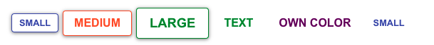

## Buttons

Props
**'size'** has available options: 'sm' for small, 'md' for medium, 'lrg' for large.\


Props
**'size'** has available options: 'sm' for small, 'md' for medium, 'lrg' for large.\
```jsx
      <Button size="sm" color="primary">small</Button>
      <Button size="md" color="secondary">medium</Button>
      <Button size="lrg" color="delete">Large</Button>
      <Button>default</Button>
```


**'color'** options: 'primary', 'secondary', 'warning', 'delete', 'success', 'any color you choose'.\

```jsx
      <Button color="delete" outlined>delete</Button>
      <Button color="warning" variant="outlined">warning</Button>
      <Button color="success">success</Button>
      <Button color="lightblue">own color</Button>
```


**'variant'** options: 'contained', 'outlined', 'text'. Text buttons have a light highlight of the text color on hover. You can use any of the primary, secondary, success, delete, or warning on text btns however,if using your own color on a text button specifically, you must pass a hex color.\

```jsx
      <Button variant="outlined" size="sm" color="primary">outlined</Button>
      <Button variant="outlined" size="md" color="secondary">outlined</Button>
      <Button variant="outlined" size="lrg" color="success">outlined</Button>
      <Button variant="text" color="success">text</Button>
      <Button variant="text" color="#660066">own color</Button>
      <Button variant="text" color='primary' size='sm'>small</Button>
```



**'disabled'** You can create your own disabled state, if disabled prop is passed, button will be lightgrey, no pointer or shadow.

```jsx
<Button disabled size='sm'>
  disabled
</Button>
```


_If no props are passed, the default styling will be size 'md', color 'primary', and variant 'contained'._
