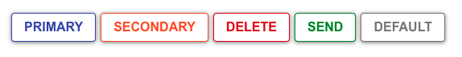

## Buttons

```jsx
    <Button size="small" variant="primary">Small</Button>
    <Button size="medium" variant="primary">Medium</Button>
    <Button size="large" variant="primary">Large</Button>
```

Props

**'size'** has available options: 'sm' for small, 'md' for medium, 'rgl' for large.\


**'variant'** options: 'primary', 'secondary', 'warning', 'delete', 'send'.\


**'type'** options: 'outlined', 'contained'.\


_If no props are passed, the default styling will be size 'md', variant 'primary', and type 'contained'._
