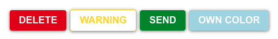

## Buttons

Props
**'size'** has available options: 'sm' for small, 'md' for medium, 'lrg' for large.\

```jsx
      <Button size="sm" color="primary">small</Button>
      <Button size="md" color="secondary">medium</Button>
      <Button size="lrg" color="delete">Large</Button>
      <Button>default</Button>
```


**'color'** options: 'primary', 'secondary', 'warning', 'delete', 'send', 'any color you choose'.\

```jsx
      <Button color="delete" outlined>delete</Button>
      <Button color="warning" variant="outlined">warning</Button>
      <Button color="send">send</Button>
      <Button color="lightblue">own color</Button>
```



**'variant'** options: 'outlined', 'contained'.\

```jsx
      <Button variant="outlined" size="sm" color="primary">outlined</Button>
      <Button variant="outlined" size="md" color="secondary">outlined</Button>
      <Button variant="outlined" size="lrg" color="send">outlined</Button>
```


**'disabled'** You can create your own disabled state, if disabled prop is passed, button will be lightgrey, no pointer or shadow.

```jsx
<Button disabled size='sm'>
  disabled
</Button>
```


_If no props are passed, the default styling will be size 'md', color 'primary', and variant 'contained'._```jsx
      <Button variant="outlined" size="sm" color="primary">outlined</Button>
      <Button variant="outlined" size="md" color="secondary">outlined</Button>
      <Button variant="outlined" size="lrg" color="send">outlined</Button>
