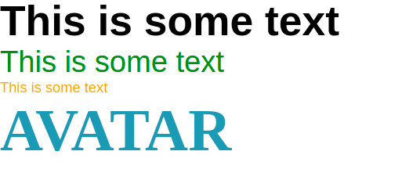

## Typography 

```jsx
      <Typography variant='large'>This is some text</Typography>
      <Typography variant='medium'>This is some text</Typography>
      <Typography variant='small'>This is some text</Typography>
      <Typography>This is some text</Typography>
```



### Props

'variant' has value of 'large', 'medium', 'small'.

Props passed can be as 'font-size', 'color', 'font-family', and 'font-weight'.

``` 
default:
      return <Medium>{props.children}</Medium> 
```    


### Props


|   	|   	|   	|   	|   	|
|---	|---	|---	|---	|---	|
|   	|   	|   	|   	|   	|
|   	|   	|   	|   	|   	|
|   	|   	|   	|   	|   	|


